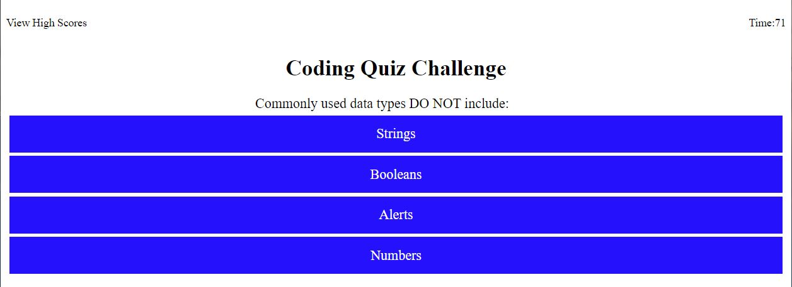

# Code Quiz

## Coding quiz to test your knowledge of coding! #
---
### **General Info:**
The task of this project was to create a website that would go through quiz questions on coding that was timed and that could record and save the high scores.

### **Requirements**
I was tasked with creating a website that would take the player through a series of questions. With each incorrect respoinse, a penalty was taken away from the remaining time. When the timer reaches 0 or when the quiz has been completed the game needed to end. Then the player should have the ability to save thier score a the end and see the current high scores. 

### **Final Notes**
This challenge was difficult for me. I was able to fulfil all the requirements but I will continue to work on this in the future to add more functionality and give it a more polished feel. As a side note, I was able to add a button at the end of the quiz that would take the player back to the beginning (this also aided me in testing the quiz) and also awards points/time for correct responses instead of just taking a penalty for incorrect answers.

### **Location:**
Website can be found at : https://mattbisbee.github.io/code-quiz/

GitHub: https://github.com/mattbisbee/code-quiz/

## **Images:**

